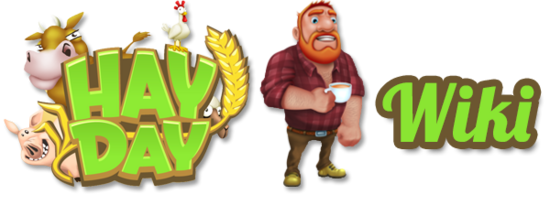
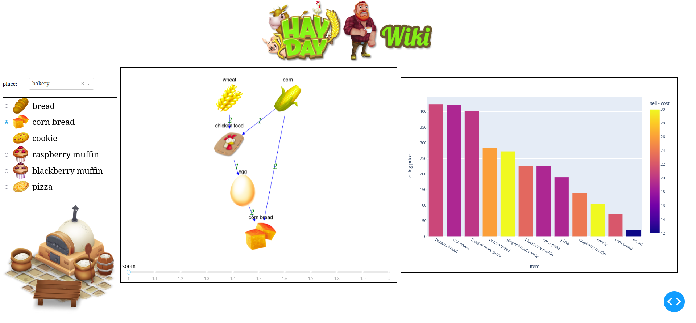
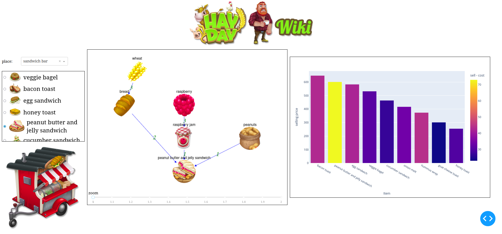
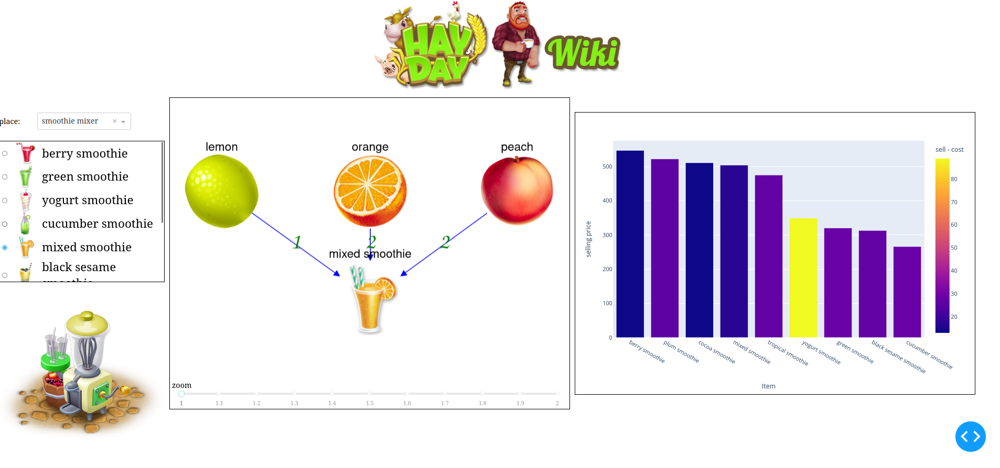

# HAYDAY
This dashboard is intended to visualize the dependencies across the items available  in the Game.

# Goal

Assist on create strategies to better play the game by looking what are the ingredients needed to produce a given item in a given place, and how much will be the allowed maximum selling price in the market.

## Screenshots

The numbers on each edge (arrow) means how many of each ingredient is required to produce the given item.

# How to run

- `python3.9+`.
- Install the modules listed in `requirements.txt`.
- Run `python3 visualization.py`.

 
# Data

The images and data (prices, ingredients, level, production time, ..) were obtained from 
https://hayday.fandom.com/wiki/Hay_Day_Wiki

# Improvements

Any idea to improve the dashboard is welcome.
